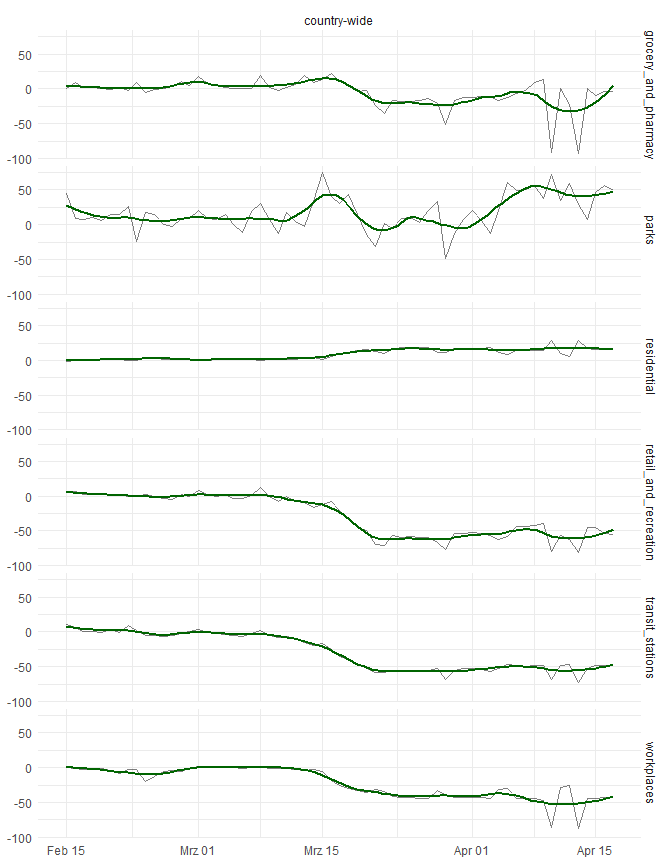
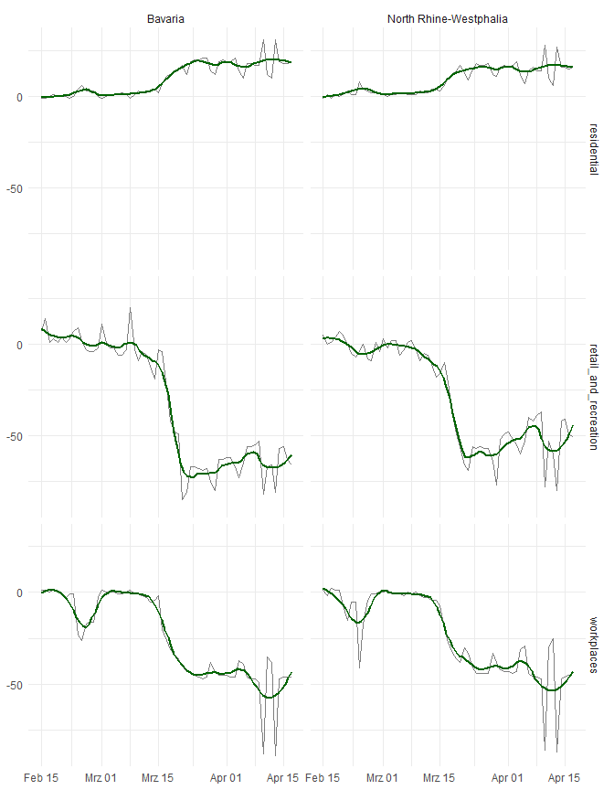
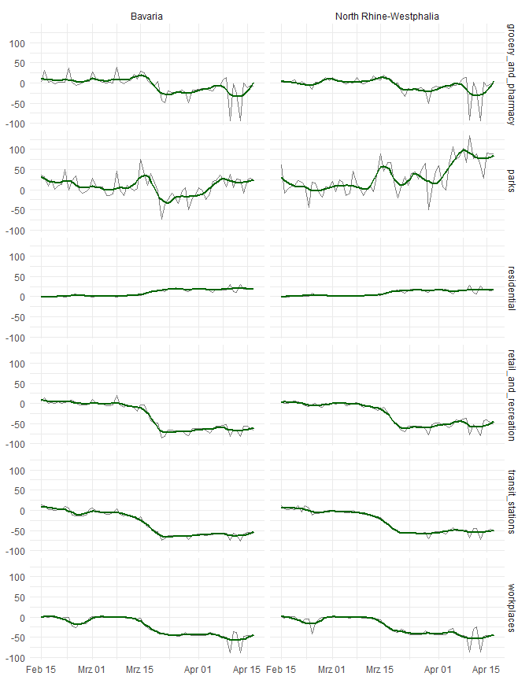

Mobility in Germany in Times of Coronavirus
================
Ansgar Wolsing
25 4 2020

## Community Mobility Reports

Community Mobility Reports are available from
<https://www.google.com/covid19/mobility/>

> These datasets show how visits and length of stay at different places
> change compared to a baseline. We calculate these changes using the
> same kind of aggregated and anonymized data used to show popular times
> for places in Google Maps.
> 
> Changes for each day are compared to a baseline value for that day of
> the week:
> 
> The baseline is the median value, for the corresponding day of the
> week, during the 5-week period Jan 3–Feb 6, 2020. The datasets show
> trends over several months with the most recent data representing
> approximately 2-3 days ago—this is how long it takes to produce the
> datasets.

    ## Rows: 230,828
    ## Columns: 11
    ## Delimiter: ","
    ## chr  [4]: country_region_code, country_region, sub_region_1, sub_region_2
    ## dbl  [6]: retail_and_recreation_percent_change_from_baseline, grocery_and_pharmacy_perce...
    ## date [1]: date
    ## 
    ## Use `spec()` to retrieve the guessed column specification
    ## Pass a specification to the `col_types` argument to quiet this message

``` r
var_suffix <- "_percent_change_from_baseline"
mob_long <- mob %>% 
  select(-country_region_code, -sub_region_2) %>% 
  # transform data into tidy format
  pivot_longer(cols = ends_with(var_suffix), names_to = "activity", values_to = "change") %>%
  # clean activity value strings
  mutate(activity = str_replace(activity, var_suffix, ""),
         sub_region_1 = ifelse(is.na(sub_region_1), "country-wide", sub_region_1))


# limit dataset to Germany
mob_ger_long <- mob_long %>% 
  filter(country_region == "Germany")
```

The dataset contains information on federal state-level and for Germany
as a whole. In the latter case, `sub_region_1` is `NA`.

``` r
plot_region <- function(x, filter_activity = "any", add_smooth = TRUE, df = mob_ger_long) {
  df <- df %>% 
    filter(sub_region_1 %in% x)
  
  if (filter_activity != "any") {
    df <- df %>% 
      filter(activity %in% filter_activity)
  }
  p <- df %>% 
    ggplot(aes(date, change)) +
    geom_line(alpha = 0.5) +
    labs(x = NULL, y = NULL) +
    theme_minimal()
  if (add_smooth){
    p <- p +
      geom_smooth(se = FALSE, method = "loess", span = 0.25, col = "darkgreen")
  }
  if (length(filter_activity) > 1 | filter_activity == "any") {
     p <- p + facet_grid(activity ~ sub_region_1)
  } else if (filter_activity == "any") {
    p <- p + facet_wrap(vars(activity))
  } else if (length(x) > 1) {
    p <- p + facet_wrap(vars(sub_region_1), ncol = 1)
  }
  p
}
```

``` r
ger_states <- distinct(mob_ger_long, sub_region_1) %>% pull(sub_region_1)
#map(ger_states, plot_region, filter_activity = "any")
```

``` r
# p1 <- plot_region("Bavaria", "retail_and_recreation")
# p2 <- plot_region("North Rhine-Westphalia", "retail_and_recreation")
# 
# p1 / p2


plot_region("country-wide", "any")
```

<!-- -->

``` r
plot_region(c("Bavaria", "North Rhine-Westphalia"), c("workplaces", "retail_and_recreation", "residential"))
```

    ## Warning in if (filter_activity != "any") {: Bedingung hat Länge > 1 und nur das
    ## erste Element wird benutzt

    ## Warning in if (length(filter_activity) > 1 | filter_activity == "any") {:
    ## Bedingung hat Länge > 1 und nur das erste Element wird benutzt

<!-- -->

``` r
plot_region(c("Bavaria", "North Rhine-Westphalia"), "any")
```

<!-- -->
