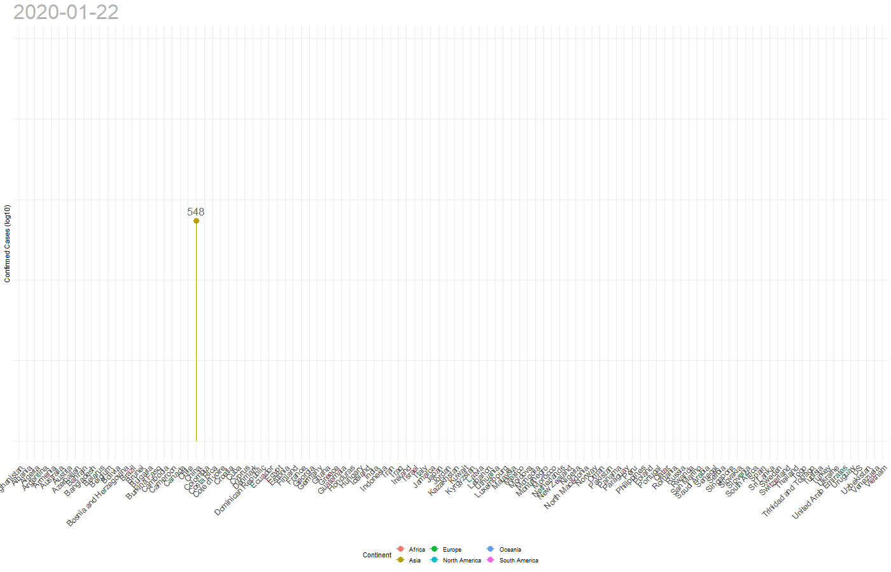

```{r setup, include=FALSE}

knitr::opts_chunk$set(echo = FALSE)

library(flexdashboard)
library(DT)
devtools::install_github("RamiKrispin/coronavirus")
library(coronavirus)
library(tidyverse)
library(lubridate)
library(sf)
library(maps)
library(mapproj)
library(leaflet)
library(plotly)

data("coronavirus")
dim(coronavirus)
coronavirus <- read_rds("../input/coronavirus.RData") 
  
library(tmap)
data("World")

```

```{r datasets, include=FALSE}
coronavirus <- coronavirus %>% 
  # merge China
  mutate(Country.Region = ifelse(
    Country.Region %in% c("Mainland China", "Macau", "Hong Kong", "Macao SAR", "Hong Kong SAR"),
    "China", Country.Region)) %>% 
  mutate(Country.Region = ifelse(Country.Region == "Iran (Islamic Republic of)", "Iran", Country.Region)) %>%
  mutate(Country.Region = ifelse(Country.Region %in% c("Republic of Korea", "Korea, South"), "South Korea", Country.Region)) %>% 
  mutate(Country.Region = ifelse(Country.Region == "Russian Federation", "Russia", Country.Region)) %>% 
  mutate(Country.Region = ifelse(Country.Region == "Republic of Moldova", "Moldova", Country.Region)) %>% 
  mutate(Country.Region = ifelse(Country.Region %in% c("Taipei and environs", "Taiwan*"), "Taiwan", Country.Region)) %>% 
  mutate(Country.Region = ifelse(Country.Region == "Viet Nam", "Vietnam", Country.Region)) %>% 
  mutate(Country.Region = ifelse(Country.Region == "Congo (Kinshasa)", "Dem. Rep. Congo", Country.Region)) %>% 
  mutate(Country.Region = ifelse(Country.Region == "Congo (Brazzaville)", "Congo", Country.Region)) %>% 
  mutate(Country.Region = ifelse(Country.Region == "Czechia", "Czech Republic", Country.Region)) %>% 
  mutate(Country.Region = ifelse(Country.Region == "United Kingdom", "UK", Country.Region)) %>% 
  mutate(Country.Region = ifelse(Country.Region == "Gambia, The", "Gambia", Country.Region)) %>% 
  mutate(Country.Region = ifelse(Country.Region %in% c("Bahamas, The", "The Bahamas"), "Bahamas", Country.Region))
  

# confirmed cases latest update
corona_confirmed_cases <- coronavirus %>% 
  filter(type == "confirmed") %>% 
  group_by(Country.Region) %>% 
  summarize(total_confirmed = sum(cases))

# cases latest update
corona_cases <- coronavirus %>% 
  group_by(type, Country.Region) %>%
  summarize(cases = sum(cases)) %>% 
  spread(key = type, value = cases) %>% 
  mutate_all(~ replace_na(., 0)) %>% 
  ungroup()

# cases overall
corona_overall <- coronavirus %>% 
  group_by(type) %>% 
  summarize(cases = sum(cases))

max_date <- max(coronavirus$date)
corona_cases_country_day <- coronavirus %>% 
  group_by(Country.Region, type, date) %>% 
  summarize(cases = sum(cases)) %>% 
  arrange(date, .by_group = TRUE) %>% 
  mutate(cumul_cases = cumsum(cases)) %>%
  # add missing days by country (missing day = no new cases reported)- start with min(date) per country
  complete(date = seq.Date(min(date), max_date, by = "day")) %>% 
  # fill empty values for newly created days with the succeeding number of cases
  fill(cumul_cases) %>% 
  # replace NA with 0
  mutate(cumul_cases = replace_na(cumul_cases, 0)) %>% 
  ungroup() 

corona_cases_world_day <- coronavirus %>% 
  filter(type == "confirmed") %>% 
  group_by(date) %>% 
  summarize(cases = sum(cases)) %>% 
  arrange(date) %>% 
  mutate(cumul_confirmed = cumsum(cases))

continents <- World %>% 
  mutate(name = as.character(name),
         name2 = case_when(name == "United States" ~ "US",
           name == "Czech Rep." ~ "Czech Republic",
           name == "Dominican Rep." ~ "Dominican Republic",
           name == "Macedonia" ~ "North Macedonia",
           name == "Korea" ~ "South Korea",
           name == "Bosnia and Herz." ~ "Bosnia and Herzegovina",
           name == "United Kingdom" ~ "UK",
            name == "Eq. Guinea" ~ "Equatorial Guinea",
            name == "Central African Rep." ~ "Central African Republic",
           TRUE ~ name)) %>% 
  select(name, name2, continent)

```


Overview {data-orientation=rows}
=====================================  

Row {data-height=850}
-----------------------------------------------------------------------

###

```{r}

# check for non-overlapping country names
check_missing_countries <- corona_confirmed_cases %>%
  anti_join(World %>%
              mutate(name = as.character(name),
              name2 = case_when(
                name == "United States" ~ "US",
                name == "Czech Rep." ~ "Czech Republic",
                name == "Dominican Rep." ~ "Dominican Republic",
                name == "Macedonia" ~ "North Macedonia",
                name == "Korea" ~ "South Korea",
                name == "Bosnia and Herz." ~ "Bosnia and Herzegovina",
                name == "United Kingdom" ~ "UK",
                name == "Eq. Guinea" ~ "Equatorial Guinea",
                name == "Central African Rep." ~ "Central African Republic",
                TRUE ~ name)),
            by = c("Country.Region" = "name2"))
# check_missing_countries

# Countries missing from World dataset: 
## Andorra
## Bahrain
## Faroe Islands
## Gibraltar
## Liechtenstein
## Monaco
## Palestine
## St. Barthelemy
## San Marino
## Singapore
## Vatican City

World_corona <- World %>% 
  mutate(name = as.character(name),
         name2 = case_when(
    name == "United States" ~ "US",
    name == "Czech Rep." ~ "Czech Republic",
    name == "Dominican Rep." ~ "Dominican Republic",
    name == "Macedonia" ~ "North Macedonia",
    name == "Korea" ~ "South Korea",
    name == "Bosnia and Herz." ~ "Bosnia and Herzegovina",
    name == "United Kingdom" ~ "UK",
    name == "Eq. Guinea" ~ "Equatorial Guinea",
    name == "Central African Rep." ~ "Central African Republic",
    TRUE ~ name)) %>% 
  left_join(corona_cases, by = c("name2" = "Country.Region")) %>% 
  sf::st_sf()

tmap_mode("view")
map <- tm_basemap(leaflet::providers$OpenStreetMap) +
  tm_shape(World_corona, name = "geometry") +
  tm_view(text.size.variable = TRUE, set.view = 3) +
  tm_polygons("confirmed", id = "name", 
              popup.vars = c("Cases:" = "confirmed", "Deaths:" = "death", "Recovered" = "recovered"),
              textNA = "No Confirmed Cases", title = "Confirmed Cases", 
              breaks = c(1, 10, 100, 1000, 10000, 20000, 80000, Inf)) +
  tm_text("confirmed", size = "AREA")

# show leaflet
map_leaflet <- tmap_leaflet(map)
map_leaflet

# cleanup
#rm(list = c("World", "World_corona"))

```

Row {data-height=150}
-----------------------------------------------------------------------

### Confirmed Cases

```{r}
confirmed_cases <- corona_overall %>% filter(type == "confirmed") %>% pull(cases)
valueBox(scales::number(confirmed_cases), icon = "fa-file-medical")
```

### Recovered

```{r}
recovered <- corona_overall %>% filter(type == "recovered") %>% pull(cases)
valueBox(scales::number(recovered), icon = "fa-heart")
```

### Deaths

```{r}
deaths <- corona_overall %>% filter(type == "death") %>% pull(cases)
valueBox(scales::number(deaths), 
         icon = "fa-times",
         color = ifelse(deaths > 10, "warning", "primary"),
         href = "#mortality")
```

### Increase Cases Worldwide

```{r}
increase_worldwide <- corona_cases_country_day %>% 
  filter(type == "confirmed") %>% 
  filter(date >= max(date) - 1) %>% 
  group_by(date) %>% 
  summarize(cumul_cases = sum(cumul_cases)) %>% 
  mutate(prev_day = lag(cumul_cases),
         diff = cumul_cases - prev_day,
         increase = diff / prev_day) %>% 
  filter(date == max(date)) %>% 
  pull(increase)

valueBox(scales::percent(increase_worldwide, accuracy = 1.1), 
         icon = "fa-percent",
         href = "#confirmed")
```

### Increase Cases Outside China

```{r}
increase_worldwide <- corona_cases_country_day %>% 
  filter(type == "confirmed") %>% 
  filter(Country.Region != "China") %>% 
  filter(date >= max(date) - 1) %>% 
  group_by(date) %>% 
  summarize(cumul_cases = sum(cumul_cases)) %>% 
  mutate(prev_day = lag(cumul_cases),
         diff = cumul_cases - prev_day,
         increase = diff / prev_day) %>% 
  filter(date == max(date)) %>% 
  pull(increase)

valueBox(scales::percent(increase_worldwide, accuracy = 1.1), 
         icon = "fa-percent",
         href = "#confirmed")
```


```{r}
cases_threshold <- 20
increase_country_max <- corona_cases_country_day %>% 
  filter(type == "confirmed") %>% 
  filter(date >= max(date) - 1) %>%
  # include only cases with a certain amount of cases on prev day
  filter(cumul_cases >= cases_threshold) %>% 
  group_by(Country.Region, date) %>% 
  summarize(cumul_cases = sum(cumul_cases)) %>% 
  # keep only if 2 previous and current day have at least {cases_threshold} cases
  filter(n() > 1) %>% 
  mutate(prev_day = lag(cumul_cases),
         diff = cumul_cases - prev_day,
         increase = diff / prev_day) %>% 
  filter(date == max(date)) %>% 
  ungroup() %>% 
  arrange(-increase) %>% 
  slice(1)

country_highest_increase_confirmed <- pull(increase_country_max, Country.Region)

```

### `r country_highest_increase_confirmed` (Highest Increase)

``` {r}
valueBox(scales::percent(pull(increase_country_max, increase), accuracy = 1.0), 
         icon = "fa-percent", href="#confirmed")
```


```{r inclde=FALSE}
plot_country_trend <- function(x, which_type = c("confirmed", "death", "recovered"), plot_type = c("line", "lollipop", "combined")) {
  if (plot_type == "line") {
    corona_cases_country_day %>% 
      filter(type == which_type) %>% 
      filter(Country.Region == x) %>% 
      ggplot(aes(date, cumul_cases)) +
      geom_line(size = 1) +
      geom_area(alpha = 0.05) +
      labs(x = NULL, y = NULL) +
      theme_minimal()
  } else if (plot_type == "lollipop") {
     corona_cases_country_day %>% 
      filter(type == which_type) %>% 
      filter(Country.Region == x) %>% 
      ggplot(aes(date, cumul_cases)) +
      geom_point(size = 2) +
      geom_segment(aes(x = date, xend = date, y = 1, yend = cumul_cases))+
      #geom_text(aes(label = scales::number(cumul_cases, accuracy = 1)), size = 3, col = "grey40", vjust = -1) +
      labs(x = NULL, y = NULL) +
      theme_minimal()
  } else if (plot_type == "combined" & which_type == "confirmed") {
    p <- corona_cases_country_day %>% 
      filter(type == "confirmed") %>% 
      filter(Country.Region == x) %>%
      mutate(cases = replace_na(cases, 0)) %>% 
      ggplot(aes(date)) +
      geom_area(aes(y = cumul_cases), alpha = 0.05) +
      geom_line(aes(y = cumul_cases, col = "Cumulative Cases",
                   text = sprintf("<b>Cumulative Cases</b>\n%s\n%d", date, cumul_cases)),
                size = 1.2, group = 1) +
      geom_col(aes(y = cases, fill = "New Cases",
                   text = sprintf("<b>New Cases</b>\n%s\n%d", date, cases))) +
      scale_fill_manual(name = "", values = c("New Cases" = scales::hue_pal()(2)[2])) +
      scale_color_manual(name = "", values = c("Cumulative Cases" = "black")) +
      labs(x = NULL, y = NULL) +
      theme_minimal() +
      theme(legend.position = "bottom")
    
    ggplotly(p, tooltip = c("text")) %>%
      # for horizontal legend since ggplotly ignores ggplots legend settings
      layout(legend = list(orientation = "h"))
  }
}

```


Confirmed Cases {#confirmed}
=====================================  

Column {data-width=600, .tabset}
-----------------------------------------------------------------------

### Increase of Confirmed Cases by Country 

```{r echo=FALSE}
p <- corona_cases_country_day %>% 
  filter(type == "confirmed") %>% 
  filter(date >= max(date) - 1) %>%
  group_by(Country.Region, date) %>% 
  summarize(cumul_cases = sum(cumul_cases)) %>% 
  mutate(prev_day = lag(cumul_cases),
         diff = cumul_cases - prev_day,
         increase = diff / prev_day) %>% 
  filter(date == max(date)) %>% 
  # include only cases with a certain amount of cases on prev day
  ungroup() %>% 
  left_join(continents, by = c("Country.Region" = "name2")) %>% 
  mutate(continent = as.character(continent),
    continent = case_when(
    Country.Region == "Bahrain" ~ "Asia",
    Country.Region == "San Marino" ~ "Europe",
    Country.Region == "Singapore" ~ "Asia",
    TRUE ~ continent
  )) %>% 
  filter(!is.na(continent)) %>% 
  ggplot(aes(cumul_cases, increase, group = Country.Region)) +
  geom_point(aes(size = log(cumul_cases), col = continent, 
                 text = sprintf("<b>%s</b>\nCases: %d\nIncrease: %s", 
                                Country.Region, cumul_cases, scales::percent(increase, accuracy = 1))
                 ), alpha = 0.5) +
  scale_x_log10(labels = scales::number) +
  scale_y_log10(labels = scales::percent_format(accuracy = 1)) +
  labs(x = "Confirmed Cases (log10)", y = "Previous Day Increase (log10)",
       col = "Continent", size = "Confirmed Cases (log)") +
  theme_minimal()

ggplotly(p, tooltip = c("text"))

```

### Worldwide

```{r}

p <- corona_cases_world_day %>% 
      mutate(cases = replace_na(cases, 0)) %>% 
      ggplot(aes(date)) +
      geom_area(aes(y = cumul_confirmed), alpha = 0.05) +
      geom_line(aes(y = cumul_confirmed, col = "Cumulative Cases",
                   text = sprintf("<b>Cumulative Cases</b>\n%s\n%d", date, cumul_confirmed)),
                size = 1.2, group = 1) +
      geom_col(aes(y = cases, fill = "New Cases",
                   text = sprintf("<b>New Cases</b>\n%s\n%d", date, cases))) +
      scale_fill_manual(name = "", values = c("New Cases" = scales::hue_pal()(2)[2])) +
      scale_color_manual(name = "", values = c("Cumulative Cases" = "black")) +
      labs(x = NULL, y = NULL) +
      theme_minimal() +
      theme(legend.position = "bottom")
    
    ggplotly(p, tooltip = c("text")) %>%
      # for horizontal legend since ggplotly ignores ggplots legend settings
      layout(legend = list(orientation = "h"))


```


### Trends over Time




Column {data-width=400, .tabset}
-----------------------------------------------------------------------

### `r country_highest_increase_confirmed` {#confirmed_highest_increase}

```{r}
max_increase_country <- pull(increase_country_max, Country.Region)
plot_country_trend(max_increase_country, "confirmed", "combined")
```


### Germany 

```{r}
plot_country_trend("Germany", "confirmed", "combined")
```

### Italy

```{r}
plot_country_trend("Italy", "confirmed", "combined")
```

### China

```{r}
plot_country_trend("China", "confirmed", "combined")
```

### Iran

```{r}
plot_country_trend("Iran", "confirmed", "combined")
```

### South Korea

```{r}
plot_country_trend("South Korea", "confirmed", "combined")
```

### USA

```{r}
plot_country_trend("US", "confirmed", "combined")
```

### France

```{r}
plot_country_trend("France", "confirmed", "combined")
```


### Spain

```{r}
plot_country_trend("Spain", "confirmed", "combined")
```


Confirmed Cases Germany
===================================== 

Column {data-width=600}
-----------------------------------------------------------------------

### 

```{r echo=FALSE, include=FALSE}
# Inspiration: https://toscano84.github.io/2018/07/using-r-to-analyse-the-german-federal-election/

library(rgdal)

# load RKI data for German federal states
rki_germany <- read_rds("../output/rki_germany.RData")
rki_germany <- rki_germany %>% 
  mutate(Bundesland = ifelse(Bundesland == "Schleswig Holstein", "Schleswig-Holstein", Bundesland))

# load and unzip shape file (https://gadm.org/download_country_v3.html)
de_shapefile_url <- "https://biogeo.ucdavis.edu/data/gadm3.6/shp/gadm36_DEU_shp.zip"
de_shapefile_zip <- "../input/de_shape.zip"
de_shapefile_folder <- "../input/de_shape"
if (!file.exists(de_shapefile_zip)) {
  download.file(de_shapefile_url, de_shapefile_zip)
}
unzip(de_shapefile_zip, exdir = "../input/de_shapefile")
shape_germany <- readOGR(dsn = "../input/de_shapefile", layer = "gadm36_DEU_1", use_iconv = TRUE, encoding = "UTF-8") 

# create a tidy dataframe from shape file and join RKI data
tidy_germany <- broom::tidy(shape_germany) %>% 
  left_join(shape_germany@data %>% rownames_to_column(var = "rowname"), by = c("id" = "rowname")) %>% 
  left_join(rki_germany, 
            by = c("NAME_1" = "Bundesland")) %>% 
  mutate(cases = replace_na(confirmed_cases, 0))
```

```{r echo=FALSE}
# plot confirmed cases on German map
p <- tidy_germany %>% 
  ggplot(aes(x = long, y = lat, group = group)) +
  geom_polygon(aes(fill = cases, 
                   text = sprintf("<b>%s</b>\nConfirmed Cases: %d", NAME_1, cases)), col = "grey70") +
  geom_polygon(data = filter(tidy_germany, (as.character(NAME_1) %in% c("Bremen", "Berlin"))), 
               aes(fill = cases, 
                   text = sprintf("<b>%s</b>\nConfirmed Cases: %d", NAME_1, confirmed_cases))) +
  coord_map() +
  #scale_fill_distiller(palette = "Reds", direction = 1) +
  scale_fill_gradient(low = rgb(255, 255, 155, maxColorValue = 255), high = rgb(183, 66, 2, maxColorValue = 255)) +
  labs(fill = "Confirmed Cases") +
  theme_void() +
  theme(legend.direction = "horizontal", legend.position = "bottom", legend.key.height = unit(2, units = "mm"))

#ggplotly(p, tooltip = c("text"))
p
```


Column {data-width=400, data-height=600}
-----------------------------------------------------------------------

### 

```{r}

rki_germany %>% 
  rename(`Federal State` = 1, `Confirmed Cases` = 2, `Increase Previous Day` = 3, `Cases per 100k Inhabitants` = 4, `Deaths` = 5, `High Risk Areas` = 6) %>% 
DT::datatable( options = list(
  pageLength = 16,
  bPaginate = FALSE))

```

Mortality {#mortality}
=====================================  

### Mortality Rates and Confirmed Cases by Country

```{r echo=FALSE}

p <- corona_cases_country_day %>% 
  filter(type %in% c("confirmed", "death")) %>% 
  filter(date == max(date)) %>%
  select(-cases) %>% 
  spread(key = type, value = cumul_cases) %>% 
  mutate(death = replace_na(death, 0),
         mortality = death / confirmed) %>% 
  # at least n cases
  filter(confirmed >= 100) %>% 
  left_join(continents, by = c("Country.Region" = "name2")) %>% 
  mutate(continent = as.character(continent),
    continent = case_when(
    Country.Region == "Bahrain" ~ "Asia",
    Country.Region == "San Marino" ~ "Europe",
    Country.Region == "Singapore" ~ "Asia",
    TRUE ~ continent
  )) %>% 
  ggplot(aes(confirmed, mortality, group = Country.Region)) +
  geom_point(alpha = 0.5,
             aes(col = continent, size = death,
             text = sprintf("<b>%s</b>\nConfirmed Cases: %d\nDeaths: %s", 
                                Country.Region, confirmed, death))) +
  annotate("text", x = 20000, y = 0.01, size = 3, hjust = "left",
           label = "Instead of actual mortality rates this plot at least partly indicates\nhow extensively testing is available in each country.") +
  scale_x_log10(label = scales::number_format(accuracy = 1)) +
  scale_y_continuous(label = scales::percent_format(accuracy = 1)) +
  labs(caption = "Only countries with at least 100 confirmed cases displayed.",
       x = "Confirmed Cases (log10)", y = "Mortality", size = "Deaths",
       col = "Continent") +
  theme_minimal()
  
  
ggplotly(p, tooltip = c("text")) %>% 
  # ggplotly ignores text-alignment from ggplot object
  style(textposition = "right")

```


Raw Data
===================================== 

### 

```{r}
DT::datatable(corona_cases, options = list(
  bPaginate = TRUE))
```
